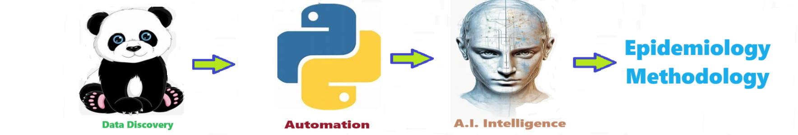

# Epidemiology Methodology - The epidemiology_methodology establishes a versatile data science methodology for epidemiology projects spanning various conditions or diseases The approach begins with comprehensive data collection, encompassing demographics, environmental factors, and relevant health metrics. Employing advanced statistical analyses and machine learning algorithms, the methodology aims to discern patterns, identify risk factors, and optimize predictive models, fostering a holistic understanding of the factors influencing the studied health outcomes.
The epidemiology_methodology establishes a versatile data science methodology for epidemiology projects spanning various conditions or diseases The approach begins with comprehensive data collection, encompassing demographics, environmental factors, and relevant health metrics. Employing advanced statistical analyses and machine learning algorithms, the methodology aims to discern patterns, identify risk factors, and optimize predictive models, fostering a holistic understanding of the factors influencing the studied health outcomes.

Welcome to the solution **Epidemiology Methodology** - an example for your projects

The epidemiology_methodology establishes a versatile data science methodology for epidemiology projects spanning various conditions or diseases The approach begins with comprehensive data collection, encompassing demographics, environmental factors, and relevant health metrics. Employing advanced statistical analyses and machine learning algorithms, the methodology aims to discern patterns, identify risk factors, and optimize predictive models, fostering a holistic understanding of the factors influencing the studied health outcomes.

## Solution Features
- Easy to understand and use  
- Easily Configurable 
- Quickly start your project with pre-built templates
- Its Fast and Automated

## Notebook Features
- **Self Documenting** - Automatically identifes major steps in notebook 
- **Self Testing** - Unit Testing for each function
- **Easily Configurable** - Easily modify with **config.INI** - keyname value pairs
- **Includes Talking Code** - The code explains itself 
- **Self Logging** - Enhanced python standard logging   
- **Self Debugging** - Enhanced python standard debugging
- **Low Code** - or - No Code  - Most solutions are under 50 lines of code
- **Educational** - Includes educational dialogue and background material
    
## Getting Started
To get started with the **Epidemiology Methodology** solution repository, follow these steps:
1. Clone the repository to your local machine.
2. Install the required dependencies listed at the top of the notebook.
3. Explore the example code provided in the repository and experiment.
4. Run the notebook and make it your own - **EASY !**
    

## Github    
## https://github.com/JoeEberle/ 

## Email 
## josepheberle@outlook.com 

    

    
## Deliverables or Figures
    
    